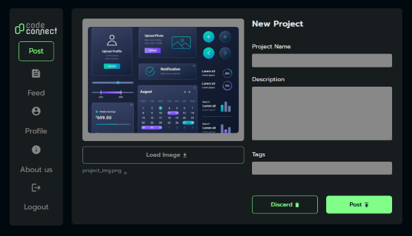

# Code-Connect

This web application was developed as part of the Alura course, JavaScript: Understanding Promises and Async/Await. The project follows the course content with personalized enhancements to meet specific needs. The deployment was done using Vercel, ensuring smooth and fast hosting.

## 🌐 Live Demo
Experience Code-Connect live at:  [Code-Connect](https://(https://code-connect-ten-mu.vercel.app/)/) 

## 🖼️ Preview

## 🔨 Project Features
- Upload images with live previews seamlessly.
- Add, remove, and validate tags dynamically.
- Process asynchronous tasks for a smoother user experience.
- Design responsive and interactive forms.
- Build scalable and maintainable code structures.

## ✔️ Technologies Used
- **HTML** Structuring the application layout and content.
- **CSS** Styling the interface for a clean and consistent design.
- **Bootstrap** Ensuring responsive and mobile-friendly layouts.
- **JavaScript** Implementing interactive features, event handling, asynchronous processes, and**DOM manipulation**.

